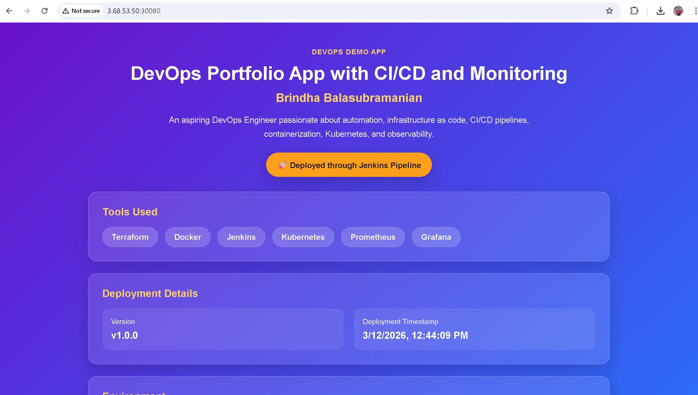
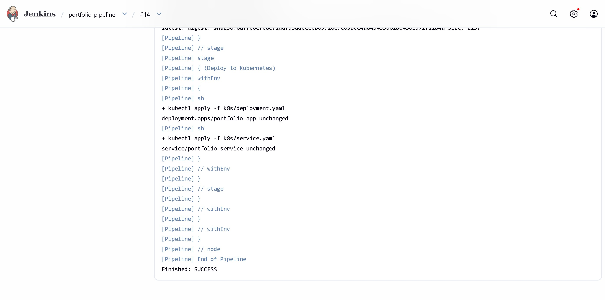
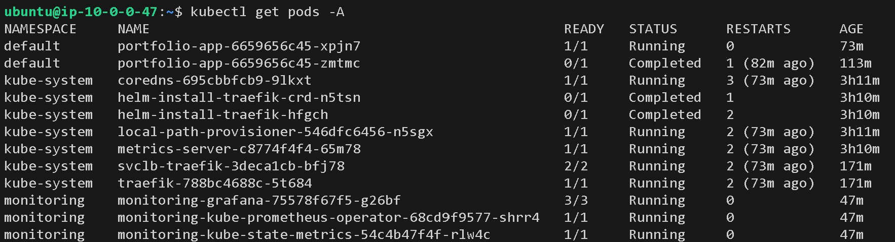
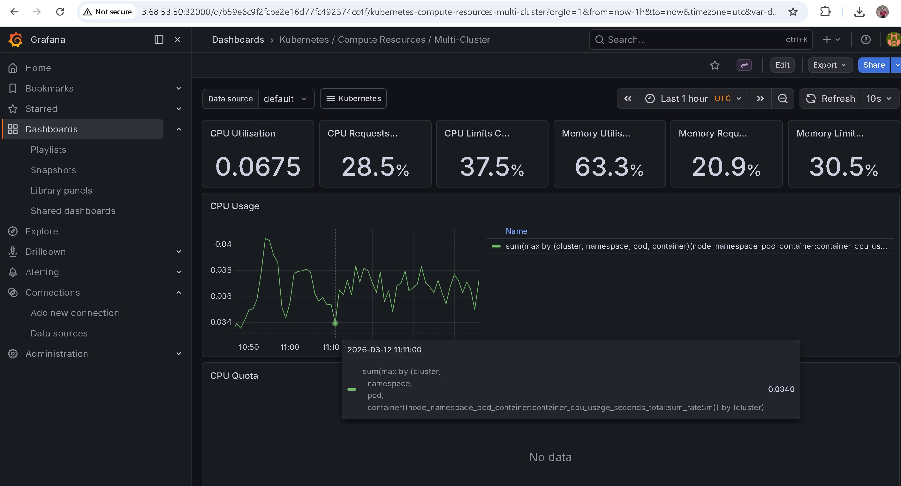

# DevOps Portfolio App

This project demonstrates a simple **end-to-end DevOps workflow** using modern tools.
The application is a static **HTML and CSS webpage served with Nginx**, while the main focus of the project is the **CI/CD pipeline, infrastructure automation, containerization, and monitoring**.

---

## Tools Used

* **AWS EC2** – Cloud infrastructure
* **Terraform** – Infrastructure as Code
* **Docker** – Containerization
* **Docker Hub** – Container registry
* **Jenkins** – CI/CD pipeline
* **Kubernetes (k3s)** – Application deployment
* **Prometheus** – Metrics collection
* **Grafana** – Monitoring dashboards
* **Git & GitHub** – Version control

---

## Project Architecture

```id="u5nyff"
Developer pushes code → GitHub
                        ↓
                 Jenkins Pipeline
                        ↓
                Docker image build
                        ↓
              Push image to Docker Hub
                        ↓
             Deploy container to Kubernetes(k3s)
                        ↓
        Prometheus collects metrics → Grafana dashboards
```

Infrastructure is provisioned using **Terraform on AWS EC2**.

---

## Project Structure

```id="gwsveb"
devops-portfolio-app
│
├── app
│   ├── index.html
│   └── style.css
│
├── docker
│   └── Dockerfile
│
├── terraform
│   ├── provider.tf
│   ├── main.tf
│   ├── variables.tf
│   └── outputs.tf
│
├── k8s
│   ├── deployment.yaml
│   └── service.yaml
│
├── Jenkinsfile
│   
│
└── README.md
```

---

## Application

The application is a simple static webpage built using **HTML and CSS**.
It is served using **Nginx inside a Docker container**.



---

## Infrastructure (Terraform)

Terraform provisions the AWS infrastructure:

* VPC
* Subnet
* Internet Gateway
* Security Group
* EC2 Instance

Example commands:

```id="wy2p0p"
terraform init
terraform apply
```

---

## Docker

The application is containerized using Docker.

Example Dockerfile:

```id="vtjfx5"
FROM nginx:alpine
COPY app /usr/share/nginx/html
```

Run locally:

```id="6s8ajp"
docker build -t devops-portfolio-app .
docker run -p 8080:80 devops-portfolio-app
```

---


## CI/CD Pipeline (Jenkins)

The Jenkins pipeline automates the application lifecycle:

1. Pull code from GitHub
2. Build Docker image
3. Push image to Docker Hub
4. Deploy the application to Kubernetes




---

## Kubernetes Deployment

The application is deployed to Kubernetes using:

* **Deployment**
* **Service**

```id="kafm7b"
kubectl apply -f k8s/
```


---

## Monitoring

Monitoring is implemented using:

* **Prometheus** for metrics collection
* **Grafana** for dashboards and visualization

Grafana dashboards display metrics such as **CPU usage, memory consumption, and container activity**.



---

## What This Project Demonstrates

* Infrastructure as Code with Terraform
* Automated CI/CD pipeline with Jenkins
* Containerized applications using Docker
* Kubernetes deployment and orchestration
* Monitoring and observability with Prometheus and Grafana

---

**Brindha**

Aspiring DevOps Engineer | Learning Cloud, Infrastructure as Code, and DevOps Practices
